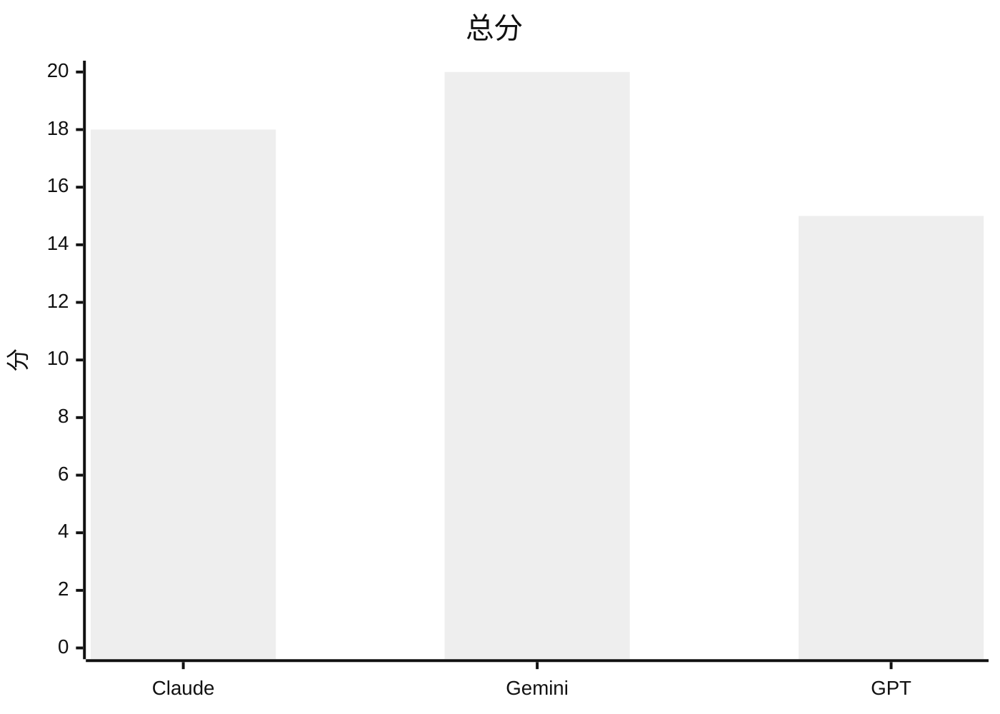
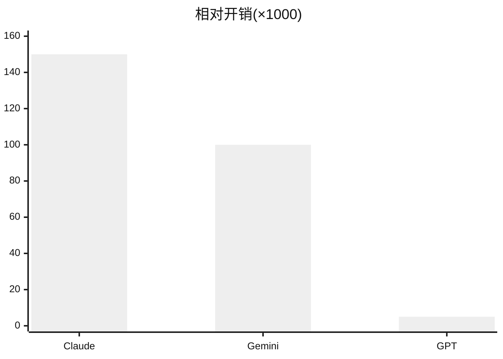

# Lua 卡牌生成实验 — 简要报告

## 1. 目的与设置

- **目的**：在统一提示词策略（`LuaCardPromptTemplate` + `LuaCardGenerationService`）下，对比三种模型生成 **Lua 卡牌脚本** 的质量与成本。
- **模型**：Claude-4.6-opus、Gemini-3-pro、GPT-4o-mini。
- **数据**：四类各 5 题（A 简单 / B 复杂 / C 模糊 / D 极端），共 **20 条**提示词；详见 `测试集.md`。
- **评分**：每类满分 **5** 分（四列对应 A、B、C、D），为人工或统一标准下的**综合正确性/可用性**评分（具体细则见项目组约定）。

---

## 2. 最终结果总表

| 模型 | A 简单<br>(/5) | B 复杂<br>(/5) | C 模糊<br>(/5) | D 极端<br>(/5) | **合计<br>(/20)** | **平均 API 开销<br>(/条)** |
|------|:---:|:---:|:---:|:---:|:---:|:---:|
| Claude-4.6-opus | 4 | 5 | 5 | 4 | **18** | 0.15 |
| Gemini-3-pro | 5 | 5 | 5 | 5 | **20** | 0.10 |
| GPT-4o-mini | 4 | 2 | 5 | 4 | **15** | **0.005** |

**读表要点**

- **Gemini** 四类全满，总分最高；单条成本介于 Claude 与 GPT 之间。
- **Claude** 在 **A**、**D** 各扣 1 分；成本高于 GPT。
- **GPT** **B 复杂类明显偏弱**（2/5），总分最低；**单条成本最低**。

---

## 3. 分项对比（表格图）

### 3.1 四类得分雷达式对照（数值表）

| 类别 | Claude | Gemini | GPT |
|:----:|:------:|:------:|:---:|
| A | 4 | 5 | 4 |
| B | 5 | 5 | 2 |
| C | 5 | 5 | 5 |
| D | 4 | 5 | 4 |

### 3.2 总分与成本（示意）

**总分（/20）—— 条形示意**

```
Claude   ██████████████████░░  18
Gemini   ████████████████████  20
GPT      ███████████████░░░░░  15
```

**平均开销/条（数值越小越省，仅作相对对比）**

```
GPT      █ 0.005
Gemini   ████████████████████████████ 0.10
Claude   █████████████████████████████████████████ 0.15
```

> 说明：开销单位与计费口径以实际 API 账单/日志为准，此处采用实验记录中的相对标度。

### 3.3 Mermaid 图（支持 Markdown 预览时渲染）

**四类得分对比（满分 5）** — 自上而下：Claude / Gemini / GPT

```mermaid
%%{init: {'theme': 'neutral'}}%%
xychart-beta
    title "四类得分（A/B/C/D）"
    x-axis [A简单, B复杂, C模糊, D极端]
    y-axis "分数" 0 --> 5
    line [4, 5, 5, 4]
    line [5, 5, 5, 5]
    line [4, 2, 5, 4]
```

*上图三条折线顺序：第 1 条 Claude，第 2 条 Gemini，第 3 条 GPT（与 Mermaid 渲染器版本有关，若图例缺失请以本表 §2 为准）。*

**总分（/20）**



**平均开销/条（×1000，仅作同尺度对比；原始：0.15 / 0.10 / 0.005）**



---

## 4. Claude 补充记录（来自测试笔记）

| 位置 | 现象 |
|------|------|
| A-2 | 生成失败（未产出可用脚本或被判不可实现） |
| B-3 | 生成效果与题意不符（需结合实机验证） |
| D-3 | 未识别「严重平衡影响」并拒绝，与理想策略不符 |

---

## 5. 简要结论

1. **质量**：**Gemini-3-pro** 在本次四类评分中**全面领先**；**GPT-4o-mini** 在 **B 复杂题**上短板明显，拉低总分。
2. **成本**：**GPT-4o-mini** 单条开销**显著低于**另两者；若预算敏感，需在质量与成本间权衡。
3. **后续**：建议将「B 类复杂交互」作为提示词与 API 暴露能力迭代的重点；对 D 类需强化「平衡/拒绝」策略的一致性（与 Claude D-3 问题对齐）。

---

## 6. 相关文件

- 提示词与数据集：`Assets/Experiments/测试集.md`
- 批量生成原始结果：`Assets/Experiments/Results/lua_batch_experiment_20260321_104746.json`
- 生成结果文字总结：`Assets/Experiments/Results/lua_batch_experiment_20260321_104746.md`
- 代码静态审查笔记：`Assets/Experiments/Results/lua_batch_experiment_20260321_104746_code_review.md`
